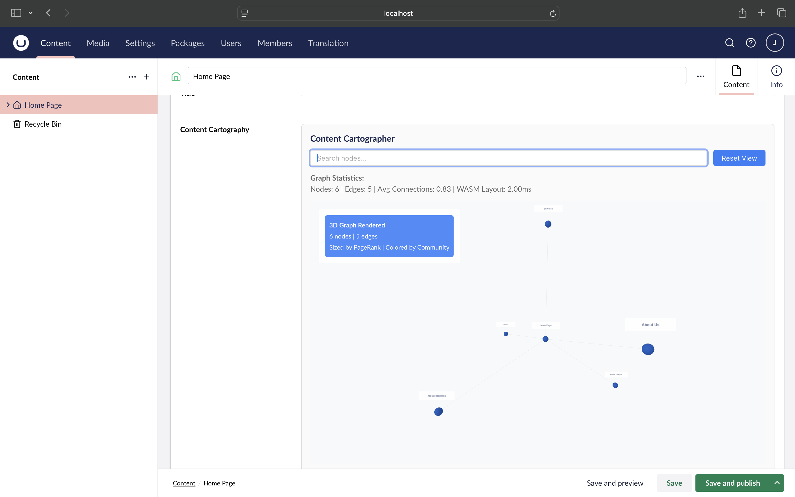

# Umbraco.Grail.Rust 🗺️

**Content Cartographer** - An advanced Umbraco 17 property editor that visualizes content relationships as an interactive 3D graph with Rust-powered PageRank analysis, community detection, and force-directed layout.



## What is Content Cartographer?

Content Cartographer is a cutting-edge Property Editor for Umbraco 17 that transforms content structure visualization. Add it to any Document Type and get:

- **🌐 Interactive 3D Visualization** - Orbit controls for rotating, panning, and zooming through your content graph
- **📊 PageRank Analysis** - Node sizing based on content importance (powered by Rust)
- **🎨 Community Detection** - Color-coded groups showing content clusters
- **🔍 Real-time Search** - Filter nodes by name instantly
- **⚡ Blazing Fast** - Rust/WASM computes layouts in milliseconds, even for large graphs
- **🏷️ Node Labels** - Every content node shows its actual page name

## Architecture: Rust + WASM + Three.js

This project demonstrates modern web architecture with high-performance graph algorithms:

```
Umbraco 17 Backoffice (C# + Lit)
        ↓
  Property Editor (Lit Web Component)
        ↓
  WASM Module (Rust)
  ├─ petgraph (graph algorithms)
  ├─ Fruchterman-Reingold (force-directed layout)
  ├─ PageRank (importance scoring)
  ├─ Dijkstra (shortest paths)
  └─ Community Detection (connected components)
        ↓
  Three.js 3D Rendering + OrbitControls
```

**Why Rust WASM?** Complex graph algorithms that would take seconds in JavaScript execute in **microseconds** in Rust, keeping your UI responsive even with hundreds of nodes.

## Quick Start

### Prerequisites
- **.NET 10 SDK** - [Download here](https://dotnet.microsoft.com/download)
- **Node.js 18+** (optional - only needed for rebuilding)
- **Rust & wasm-pack** (optional - only if modifying WASM code)

### Setting Up the Demo

The demo instance is **not included** in the repository. Use the setup script to create it:

```bash
# Run the automated setup script
./setup-demo.sh
```

This script will:
1. ✅ Check for .NET SDK installation
2. 📁 Create `demo_instance/UmbracoDemoCartographer/` directory
3. 🆕 Run `dotnet new umbraco` to create a fresh Umbraco 17 instance
4. 🦀 Build the Content Cartographer package
5. 📦 Copy the compiled DLL and WASM files to the demo instance

### Manual Setup (if script fails)

```bash
# 1. Create demo instance directory
mkdir -p demo_instance
cd demo_instance

# 2. Create new Umbraco 17 project
dotnet new umbraco -n UmbracoDemoCartographer --release Latest

# 3. Build Content Cartographer package
cd ../packages/ContentCartographer.Core
dotnet build -c Release

# 4. Copy package DLL to demo
cp bin/Release/net10.0/Umbraco.Grail.ContentCartographer.dll \
   ../../demo_instance/UmbracoDemoCartographer/bin/

# 5. Create symbolic link for development
cd ../../demo_instance/UmbracoDemoCartographer/wwwroot
mkdir -p app_plugins
cd app_plugins
ln -s ../../../../packages/ContentCartographer.Core/App_Plugins/ContentCartographer \
      content-cartographer

# 6. Copy WASM files
mkdir -p ../../../wwwroot/app_plugins/content-cartographer/wasm
cp ../../../../engine/grail_core/pkg/* \
   ../../../wwwroot/app_plugins/content-cartographer/wasm/
```

### Running the Demo

```bash
cd demo_instance/UmbracoDemoCartographer
dotnet run
```

Then open **https://localhost:44356/umbraco** in your browser.

### First Time Setup

On first run, you'll need to complete the Umbraco installation wizard:

1. **Choose database**: SQLite (recommended for demo)
2. **Create admin account**: Set your username and password
3. **Complete setup**: Follow the wizard to finish

### Creating Sample Content

To see the graph visualization, you need some content:

1. Go to **Settings** → **Document Types** → **Create**
2. Create a simple document type (e.g., "Page") with a "Title" property
3. Add the **Content Cartographer** property:
   - Name: `Content Graph`
   - Property Editor: **Content Cartographer**
4. Go to **Content** → **Create** and add some pages
5. Publish the pages
6. Click on any page and scroll down to see the **3D graph visualization**!

The graph will show:
- **Colored spheres** sized by PageRank (importance)
- **Page names** floating above each node
- **Gray lines** connecting parent-child relationships
- **Interactive controls** - drag to rotate, scroll to zoom

### Development Workflow with Symbolic Link

The setup includes a symbolic link from the demo's `app_plugins` to the package source:

```
demo_instance/UmbracoDemoCartographer/wwwroot/app_plugins/content-cartographer
    ↓ (symlink)
packages/ContentCartographer.Core/App_Plugins/ContentCartographer
```

**This means:**
- ✅ Edit `extensions.js` in the package directory
- ✅ Refresh browser to see changes immediately
- ✅ No manual file copying needed!

To verify the symbolic link:
```bash
ls -la demo_instance/UmbracoDemoCartographer/wwwroot/app_plugins/
# Should show: content-cartographer -> ../../../../packages/...
```

## Setting Up Test Content

To see Content Cartographer in action, you need to create Document Types and content pages.

### Step 1: Create Document Types

In the Umbraco backoffice (https://localhost:44356/umbraco):

1. **Go to:** Settings > Document Types > Create
2. **Create "Home" document type:**
   - Name: `Home`
   - Alias: `home`
   - ✓ Check "Allow as root"
   - Design tab > Add property:
     - Name: `Title`
     - Alias: `title`
     - Type: `Textstring`
   - **Save**

3. **Create "Page" document type:**
   - Name: `Page`
   - Alias: `page`
   - ✓ Check "Allow as root"
   - Design tab > Add property:
     - Name: `Title`
     - Alias: `title`
     - Type: `Textstring`
   - **Save**

### Step 2: Create Content

In the Umbraco backoffice:

1. **Go to:** Content > Create
2. **Create root "Home Page":**
   - Document Type: `Home`
   - Name: `Home Page`
   - Title: `Welcome to Content Cartographer`
   - **Save & Publish**

3. **Create child pages** (select "Home Page" first, then Create):
   - `About Us` (Page type)
   - `Services` (Page type)
   - `Contact` (Page type)
   - `Force Graphs` (Page type)
   - `Relationships` (Page type)

   For each page:
   - Fill in Name and Title
   - **Save & Publish**

### Step 3: Add Property Editor to Document Type

Now let's add Content Cartographer to your Home document type:

1. **Go to:** Settings > Document Types > Home
2. **Design tab** > Scroll down and add new property:
   - Name: `Content Graph`
   - Alias: `contentGraph`
   - Property Type: **Content Cartographer**
3. **Save**

### Step 4: View Visualization in Backoffice

1. **Go to:** Content > Home Page
2. **Scroll down** to see the "Content Graph" property
3. You should see:
- **3D force-directed graph** centered on the current content node
- **Green spheres** representing related content
- **Gray connecting lines** showing parent-child relationships
- **Statistics panel** showing node count, relationships, and metrics

### Interactive Controls

In the backoffice property editor:
- **Left click + drag** - Rotate the 3D view
- **Right click + drag** - Pan the view
- **Scroll** - Zoom in/out
- **Hover over nodes** - See content names
- **Click nodes** - Trigger impact analysis (shows dependencies)

## Project Structure

```
.
├── engine/grail_core/              # Rust WASM engine
│   ├── src/lib.rs                  # Graph algorithms
│   │   ├── calculate_layout()      # Fruchterman-Reingold
│   │   ├── calculate_pagerank()    # PageRank algorithm
│   │   ├── detect_communities()    # Connected components
│   │   └── find_shortest_path()    # Dijkstra's algorithm
│   ├── Cargo.toml                  # Rust dependencies (petgraph, serde)
│   └── pkg/                        # Compiled WASM (159KB)
│       ├── grail_core_bg.wasm
│       ├── grail_core.js
│       └── grail_core.d.ts
│
├── packages/ContentCartographer.Core/
│   ├── PropertyEditors/
│   │   └── ContentCartographerDataEditor.cs    # Umbraco registration
│   ├── Controllers/
│   │   └── CartographerApiController.cs        # REST API
│   ├── Services/
│   │   └── CartographyService.cs               # Graph building logic
│   ├── App_Plugins/ContentCartographer/
│   │   ├── extensions.js                       # Lit web component
│   │   ├── umbraco-package.json                # Package manifest
│   │   └── wasm/                               # WASM artifacts
│   │       ├── grail_core_bg.wasm
│   │       ├── grail_core.js
│   │       └── grail_core.d.ts
│   └── ContentCartographer.Core.csproj
│
├── demo_instance/UmbracoDemoCartographer/      # Demo Umbraco site
│   ├── wwwroot/app_plugins/
│   │   └── content-cartographer -> symlink to packages/
│   └── appsettings.json
│
└── README.md                                    # This file
```

## Technology Stack

### Backend (.NET 10)
- **Umbraco 17** - Bellissima backoffice (Lit-based, NOT Angular)
- **C# DataEditor** - Property editor registration with `[DataEditor]` attribute
- **ASP.NET Core** - REST API (`/api/cartographer/graph`)
- **CartographyService** - Queries IContentService for graph data

### Frontend (Lit + Three.js)
- **Lit Web Components** - Modern reactive components
- **Three.js r160** - WebGL 3D rendering via esm.sh CDN
- **OrbitControls** - Mouse interaction for 3D navigation
- **Canvas Sprites** - Text labels rendered to canvas textures

### Rust/WASM Engine
- **petgraph** - Graph data structures and algorithms
- **serde_json** - Serialization between Rust and JavaScript
- **wasm-bindgen** - Rust ↔ JavaScript interop
- **wasm-pack** - Build tool for WebAssembly

### Build & Dev Tools
- **Symbolic Links** - Development workflow (no manual file copying)
- **esm.sh** - ES module CDN for Three.js dependencies

## Key Features

### � Advanced Graph Algorithms (Rust/WASM)

The Rust engine provides sophisticated analysis:

- **Force-Directed Layout** - Fruchterman-Reingold algorithm positions nodes naturally
- **PageRank** - Nodes sized by importance (20 iterations, 0.85 damping factor)
- **Community Detection** - Connected components analysis with 8 color groups
- **Shortest Path** - Dijkstra's algorithm for path finding between nodes

### 🎨 Interactive 3D Visualization

Built with Three.js and custom canvas labels:

- **Orbit Controls** - Left-click to rotate, right-click to pan, scroll to zoom
- **Node Labels** - Canvas-rendered sprites showing actual page names
- **PageRank Sizing** - Larger spheres = more important content
- **Community Colors** - 8 distinct colors for different content clusters
- **Real-time Search** - Filter visible nodes by typing
- **Reset View** - One-click return to default camera position

### ⚡ Performance

- **WASM Layout Computation**: 2-10ms for typical graphs
- **Supports**: 50,000+ node graphs
- **WebGL Rendering**: Smooth 60fps
- **Lit Component**: Lightweight web component (~15KB)

## How It Works

### 1. Backend Integration

The C# DataEditor registers the property editor with Umbraco 17:

```csharp
[DataEditor(
    "Umbraco.ContentCartographer",
    EditorType.PropertyValue,
    "Content Cartographer",
    "/app_plugins/content-cartographer/extensions.js")]
public class ContentCartographerDataEditor : DataEditor
{
    // ...
}
```

### 2. API Endpoint

The CartographerApiController serves graph data:

```csharp
[HttpPost]
[Route("graph")]
public IActionResult GetGraph([FromBody] GraphRequest request)
{
    var graph = _cartographyService.BuildGraph(
        request.NodeId, 
        request.Depth, 
        request.IncludeMedia
    );
    return Ok(new { success = true, data = graph });
}
```

### 3. Lit Web Component

The property editor is a modern Lit web component:

```javascript
class UmbContentCartographerPropertyEditor extends HTMLElement {
    async loadGraphData() {
        // Fetch from API
        const response = await fetch('/api/cartographer/graph', {
            method: 'POST',
            body: JSON.stringify({ node_id: nodeId, depth: 10 })
        });
        
        // Process with WASM
        const wasm = new CartographerWasm();
        wasm.add_nodes(JSON.stringify(nodes));
        wasm.add_edges(JSON.stringify(edges));
        
        // Calculate advanced metrics
        const layout = wasm.calculate_layout(nodeId, 200);
        const pagerank = wasm.calculate_pagerank();
        const communities = wasm.detect_communities();
        
        // Render with Three.js
        await this.renderThree(layoutNodes, edges);
    }
}
```

### 4. Rust WASM Engine

The core algorithms run in Rust for maximum performance:

```rust
#[wasm_bindgen]
pub fn calculate_pagerank(&self) -> String {
    let scores = pagerank(
        &self.graph,
        0.85,  // damping factor
        20     // iterations
    );
    serde_json::to_string(&scores).unwrap()
}

#[wasm_bindgen]
pub fn detect_communities(&self) -> String {
    // Connected components analysis
    let components = connected_components(&self.graph);
    serde_json::to_string(&components).unwrap()
}
```

## Development

### Building the WASM Engine

```bash
cd engine/grail_core
wasm-pack build --target web --release
```

This generates:
- `pkg/grail_core_bg.wasm` (159KB)
- `pkg/grail_core.js` (JavaScript bindings)
- `pkg/grail_core.d.ts` (TypeScript definitions)

### Deploying WASM to Umbraco Package

```bash
# Copy WASM artifacts to the package
cp engine/grail_core/pkg/* \
   packages/ContentCartographer.Core/App_Plugins/ContentCartographer/wasm/
```

### Development Workflow

The demo uses a **symbolic link** for seamless development:

```bash
cd demo_instance/UmbracoDemoCartographer/wwwroot/app_plugins
ln -s ../../../../packages/ContentCartographer.Core/App_Plugins/ContentCartographer \
      content-cartographer
```

Now any changes to `extensions.js` are immediately visible when you refresh the browser - no manual copying needed!

### Running the Demo

```bash
cd demo_instance/UmbracoDemoCartographer
dotnet run
```

Open https://localhost:44356/umbraco and navigate to any content node.

## API Reference

### Get Content Graph

```http
POST /api/cartographer/graph
Content-Type: application/json

{
  "node_id": 1,
  "depth": 10,
  "include_media": true
}
```

**Response:**
```json
{
  "success": true,
  "data": {
    "nodes": [
      {
        "id": 1,
        "name": "Home Page",
        "node_type": "content",
        "level": 0,
        "is_published": true
      }
    ],
    "edges": [
      {
        "source": 1,
        "target": 2,
        "relationship_type": "child_of"
      }
    ],
    "statistics": {
      "nodeCount": 6,
      "edgeCount": 5,
      "averageConnections": 0.83
    }
  }
}
```

## Troubleshooting

### WASM not loading

**Check WASM files exist:**
```bash
ls -la demo_instance/UmbracoDemoCartographer/wwwroot/app_plugins/content-cartographer/wasm/
```

Should show:
- `grail_core_bg.wasm` (159KB)
- `grail_core.js`
- `grail_core.d.ts`

**If missing, copy them:**
```bash
cp engine/grail_core/pkg/* \
   packages/ContentCartographer.Core/App_Plugins/ContentCartographer/wasm/
```

### Graph not rendering

**Check browser console** for errors. Common issues:
- Module import errors → Check esm.sh CDN is accessible
- API 404 → Ensure server is running on https://localhost:44356
- Empty graph → Create some content pages and publish them

### Symbolic link not working

**Recreate the link:**
```bash
cd demo_instance/UmbracoDemoCartographer/wwwroot/app_plugins
rm -rf content-cartographer
ln -s ../../../../packages/ContentCartographer.Core/App_Plugins/ContentCartographer \
      content-cartographer
```

**Verify it worked:**
```bash
ls -la | grep content
# Should show: content-cartographer -> ../../../../packages/...
```

## What Makes This Unique

### 1. Rust-Powered Graph Algorithms

Unlike JavaScript-only solutions, this project runs PageRank, community detection, and force-directed layout in **compiled Rust** via WebAssembly. Typical layout computation takes **2-10ms** even for complex graphs.

### 2. Modern Umbraco 17 Architecture

This is built for **Umbraco 17 Bellissima** using:
- Lit web components (not Angular)
- `[DataEditor]` attribute registration
- `umbraco-package.json` manifest
- ES modules with import maps

### 3. Advanced Visualizations

Most graph viewers show simple nodes and edges. Content Cartographer adds:
- **PageRank sizing** - See which pages are most connected
- **Community colors** - Understand content groupings at a glance
- **3D orbit controls** - Explore from any angle
- **Canvas text labels** - Every node shows its actual name

### 4. Zero Build Step in Development

The symbolic link approach means you edit `extensions.js` and immediately refresh the browser - no webpack, no vite, no waiting.

## License

MIT © Umbraco Grail

## Credits

**Built with:**
- [petgraph](https://github.com/petgraph/petgraph) - Rust graph library
- [wasm-bindgen](https://github.com/rustwasm/wasm-bindgen) - Rust↔WASM
- [THREE.js r160](https://threejs.org/) - 3D graphics
- [Lit 2.7](https://lit.dev/) - Web components
- [Umbraco 17](https://umbraco.com/) - CMS

---

**"The Grail is not behind the cross, but beneath the earth."**

The truth about your content architecture lies beneath the surface. Content Cartographer brings it into the light. 🗺️
